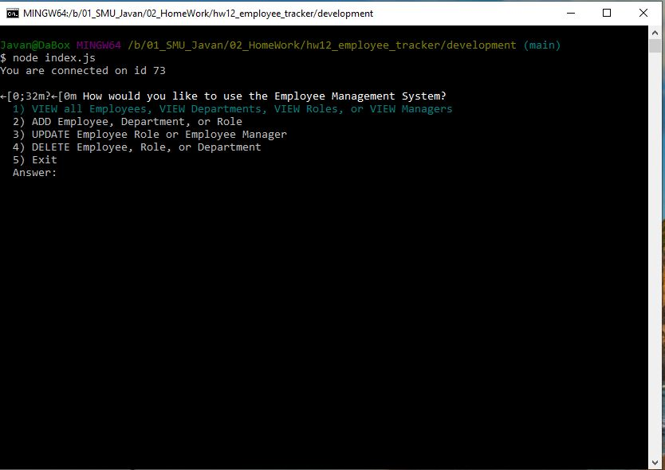
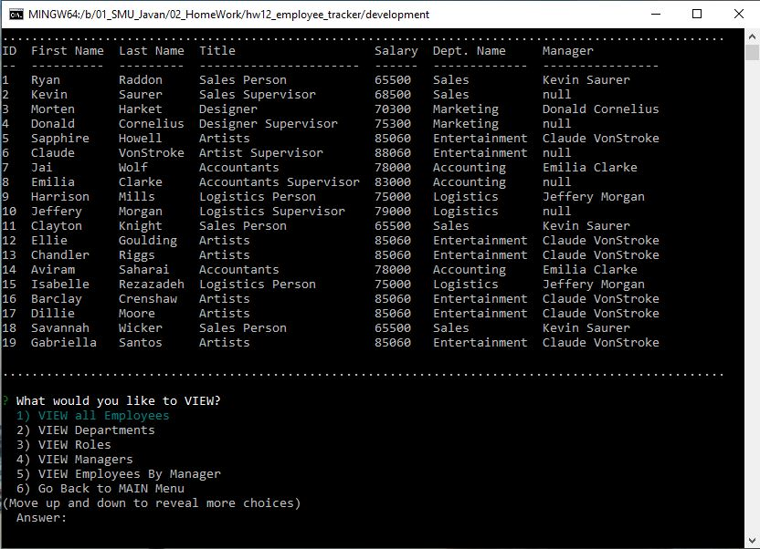
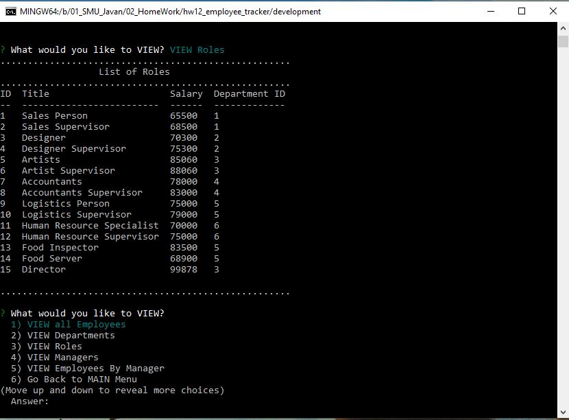

# Employee Tracker

  

***

  ## Description:
  This application allows the user to manage employee data for a business, organization, or any entity the deals with employee data.  It allows the user to enter employee's names, department, role/title, salary, and managerial status.  Employee
  
***
  ## Table of Contents:
  1.  [Description](#description)
  2.  [Demonstration](#demonstration)
  3.  [Installation](#installation)
  4.  [Screenshots](#screenshots)
  5.  [Technologies](#technologies)
  6.  [Usage](#usage)
  7.  [License](#license)
  8.  [Contributing](#contributing)
  9.  [Tests](#tests)
  10.  [Questions](#questions)

***
  ## Demonstration:
  [Deployed Application](https://youtu.be/chaSdIWa4Sk)

***
  ## Installation:
  To use this application, the user can fork or clone.  Then `npm i mysql, inquirer, an console.table`.  This needs to be executed on Node.js.

***
  ## Screenshots:
  ### (Application Deployed Bash)
  

  ### (View of Employees)
  

  ### (Viewing Roles)
  

***
  ## Technologies
    - Node.js
    - MySQL
    - Inquirer
    - Console.table

  ## Usage:
  This application can be used to manage employees in a business or small organization.
   
***
  ## License:
  This project falls under the MIT License.  The full documentation for this license can be found at [MIT Full Documentation](https://choosealicense.com/licenses/mit).

  Below is an excerpt of the MIT License.
   
  Copyright <YEAR> <COPYRIGHT HOLDER>
    
    Permission is hereby granted, free of charge, to any person obtaining a copy of this software and associated documentation files (the "Software"), to deal in the Software without restriction, including without limitation the rights to use, copy, modify, merge, publish, distribute, sublicense, and/or sell copies of the Software, and to permit persons to whom the Software is furnished to do so, subject to the following conditions:
    The above copyright notice and this permission notice shall be included in all copies or substantial portions of the Software.
    THE SOFTWARE IS PROVIDED "AS IS", WITHOUT WARRANTY OF ANY KIND, EXPRESS OR IMPLIED, INCLUDING BUT NOT LIMITED TO THE WARRANTIES OF MERCHANTABILITY, FITNESS FOR A PARTICULAR PURPOSE AND NONINFRINGEMENT. IN NO EVENT SHALL THE AUTHORS OR COPYRIGHT HOLDERS BE LIABLE FOR ANY CLAIM, DAMAGES OR OTHER LIABILITY, WHETHER IN AN ACTION OF CONTRACT, TORT OR OTHERWISE, ARISING FROM, OUT OF OR IN CONNECTION WITH THE SOFTWARE OR THE USE OR OTHER DEALINGS IN THE SOFTWARE.

  ## Contributing:
  To contribute to this project, please send an email.  
   
  The contributors for this project are: D. Javan Worthy.

***
  ## Tests:
  There are no special test for this application.

***
  ## Questions:
  - The GitHub profile for this project is https://github.com/djavanw/employee_tracker.
 
  - If there are any questions, the contributor can be reached at fakemail@qmail.us.com.

